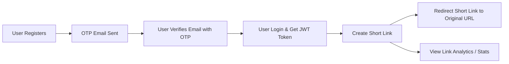

 # SmartLink API Documentation

**SmartLink API** is a FastAPI-based URL shortening service with user authentication, email verification via OTP, and link analytics. Users can register, verify their email, create short links, and track link clicks.

---

## Base URL

```

https://smartlink-fu2v.onrender.com

```


---

## Authentication

- JWT **access tokens** are used for authentication.
- Obtain token via `/users/login`.
- Include in request headers for protected endpoints:

```

Authorization: Bearer <access_token>

```

---

## User Endpoints

### 1. Register User

```

POST /users/register

````

**Request Body (JSON)**

```json
{
  "username": "john",
  "email": "john@example.com",
  "password": "Strong@123"
}
````

**Response (200 OK)**

```json
{
  "id": "user-uuid",
  "username": "john",
  "email": "john@example.com",
  "created_at": "2025-11-04T23:59:59Z"
}
```

**Notes:**

* Sends an OTP to the provided email.
* Password requirements:

  * At least 1 digit
  * At least 1 uppercase letter
  * At least 1 lowercase letter
  * At least 1 special character

---

### 2. Verify Email

```
POST /users/verify-email
```

**Query Parameters**

```
email=<user_email>&otp=<otp_code>
```

**Response (200 OK)**

```json
{
  "message": "User Verified Successfully."
}
```

**Error Codes:**

* 404: User not found
* 400: OTP expired or invalid

---

### 3. Login

```
POST /users/login
```

**Request (Form Data)**

```
username=<email>
password=<password>
```

**Response (200 OK)**

```json
{
  "access_token": "<jwt_token>",
  "token_type": "bearer"
}
```

**Error Codes:**

* 401: Incorrect email or password
* 400: User not verified

---

### 4. Request OTP

```
POST /users/otp-request
```

**Query Parameter**

```
email=<user_email>
```

**Response (200 OK)**

```json
{
  "message": "OTP sent successfully",
  "email": "user@example.com"
}
```

---

## Link Endpoints

> All link endpoints require a valid JWT in the `Authorization` header.

### 1. Create Short Link

```
POST /links/
```

**Request Body**

```json
{
  "original_url": "https://example.com"
}
```

**Response (200 OK)**

```json
{
  "id": "link-uuid",
  "original_url": "https://example.com",
  "short_url": "abc12345",
  "click_count": 0,
  "created_date": "2025-11-04T23:59:59Z"
}
```

---

### 2. Redirect Short Link

```
GET /links/{short_url}
```

**Response (307 Temporary Redirect)**

* Redirects to the original URL.
* Example: `short_url = abc12345` → redirects to `https://example.com`

---

### 3. Get All Links

```
GET /links/get/all
```

**Response (200 OK)**

```json
[
  {
    "id": "link-uuid",
    "original_url": "https://example.com",
    "short_url": "abc12345",
    "click_count": 5,
    "created_date": "2025-11-04T23:59:59Z"
  }
]
```

---

### 4. Link Analytics / Stats

```
GET /links/{short_url}/stats
```

**Response (200 OK)**

```json
{
  "original_url": "https://example.com",
  "short_code": "abc12345",
  "clicks_count": 10,
  "created_at": "2025-11-04T23:59:59Z",
  "recent_clicks": [
    {
      "timestamp": "2025-11-04T23:50:00Z",
      "user_agent": "Mozilla/5.0",
      "referrer": "https://google.com",
      "ip": "192.168.1.1"
    }
  ]
}
```

---

## Error Codes

| HTTP Code | Meaning                           |
| --------- | --------------------------------- |
| 200       | Success                           |
| 400       | Bad request / validation failed   |
| 401       | Unauthorized / invalid token      |
| 404       | Resource not found (user or link) |
| 500       | Server error                      |

---

## Examples

**cURL: Register User**

```bash
curl -X POST "http://127.0.0.1:8000/users/register" \
-H "Content-Type: application/json" \
-d '{"username":"john","email":"john@example.com","password":"Strong@123"}'
```

**cURL: Create Short Link**

```bash
curl -X POST "http://127.0.0.1:8000/links/" \
-H "Authorization: Bearer <jwt_token>" \
-H "Content-Type: application/json" \
-d '{"original_url":"https://example.com"}'
```

---

## Testing

Run tests with:

```bash
pytest tests/ -v
```

* Uses SQLite for testing.
* Includes fixtures for users and links.
* OTP emails are mocked for tests.

---

## Notes for Public API

1. Use HTTPS in production.
2. Limit OTP requests to avoid spamming.
3. Tokens expire after `ACCESS_TOKEN_EXPIRATION_MINUTES`.
4. Follow rate-limiting and secure password policies.

---

## Workflow Diagram


